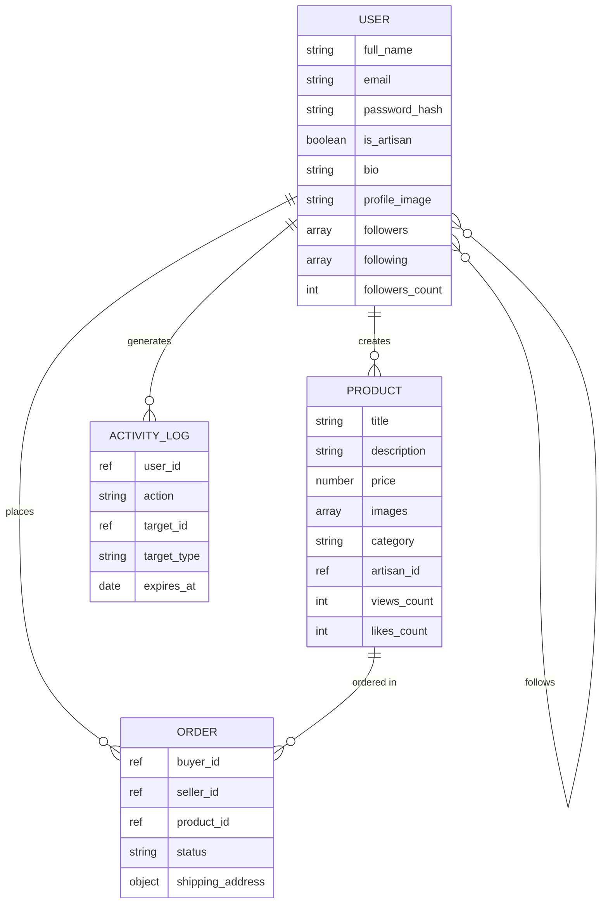

<p align="center">
  
</p>

<h1 align="center">✦ Craftelier</h1>

<p align="center">
  <em>Where Craft Meets Elegance</em>
</p>

<p align="center">
  A premium social e-commerce platform where artisans showcase their work, gain followers, and sell handcrafted goods — built with gallery-grade aesthetics and production-ready architecture.
</p>

<p align="center">
  
  
  
  
  
  
</p>

---

## ✦ Overview

**Craftelier** is a full-stack artisan marketplace that bridges the gap between talented craftspeople and art enthusiasts. Think of it as a curated gallery meets social network — artisans can build their following, showcase collections, and sell directly to collectors.

### Why Craftelier?

| Problem | Solution |
|---------|----------|
| Artisans lack premium platforms to showcase work | Gallery-grade product display with elegant typography |
| Buyers can't discover new artisans easily | Smart 3-tier recommendation engine |
| Generic marketplaces dilute craft identity | Social features: follow, galleries, artisan profiles |
| Security concerns in small marketplaces | JWT auth, rate limiting, input validation, helmet headers |

---

## ✦ Features

### For Artisans
- 🎨 **Personal Gallery** — Beautiful profile page showcasing your craft collection
- ➕ **Easy Listing** — Create product listings with images, pricing, and categories
- 👥 **Build Following** — Collectors can follow you and see your new work
- 📊 **Analytics** — Track views, likes, and engagement on each piece

### For Collectors
- 🔍 **Smart Discovery** — AI-powered 3-tier recommendation algorithm
- ❤️ **Like & Save** — Engage with pieces you love
- 🏪 **Artisan Galleries** — Browse an artisan's complete collection
- 👤 **Unified Identity** — Switch between collector and artisan mode anytime

### Platform
- 🔐 **Secure Authentication** — JWT with bcrypt (12 salt rounds)
- 🛡️ **Production Security** — Helmet, CORS, rate limiting, input validation
- 📱 **Responsive Design** — Seamless on desktop, tablet, and mobile
- ⚡ **Fast** — Vite hot reload, optimized queries, lazy-loaded images

---

## ✦ Tech Stack

```
┌─────────────────────────────────────────────┐
│  FRONTEND                                   │
│  React 18 · Vite 6 · TailwindCSS 3          │
│  React Router · Axios · Lucide Icons        │
├─────────────────────────────────────────────┤
│  BACKEND                                    │
│  Node.js · Express 4 · Mongoose 8           │
│  JWT · bcrypt · express-validator           │
├─────────────────────────────────────────────┤
│  DATABASE                                   │
│  MongoDB Atlas · 4 Models · Indexed         │
├─────────────────────────────────────────────┤
│  SECURITY                                   │
│  Helmet · CORS · Rate Limiting · Validation │
└─────────────────────────────────────────────┘
```

---

## ✦ Screenshots

<details>
<summary><b>🏠 Landing Page</b></summary>
<br>
Premium hero section with elegant serif typography, featured categories, platform stats, and call-to-action — all in a warm cream palette with gold accents.
</details>

<details>
<summary><b>📊 Dashboard</b></summary>
<br>
Personalized feed with "Artisans to Follow" (profile photos, follower counts) and "Recommended Crafts" in a 4-column masonry grid with lazy-loaded images, prices, and engagement metrics.
</details>

<details>
<summary><b>🎨 Craft Detail</b></summary>
<br>
Full product view with image gallery, category badge, price, description, artisan card with "View Gallery" link, and Like/Contact CTA buttons.
</details>

<details>
<summary><b>👤 Artisan Gallery</b></summary>
<br>
Artisan profile page with bio, follower count, follow/unfollow button, and a grid of all their crafts.
</details>

---

## ✦ Architecture

```
craftelier/
├── client/                         # React + Vite + TailwindCSS
│   ├── src/
│   │   ├── context/AuthContext.jsx  # Global auth state + JWT persistence
│   │   ├── services/api.js         # Axios instance + interceptors
│   │   ├── components/layout/      # Navbar (glassmorphic, responsive)
│   │   ├── pages/
│   │   │   ├── Landing.jsx         # Hero, categories, stats, CTA
│   │   │   ├── Login.jsx           # Split-layout auth form
│   │   │   ├── Signup.jsx          # Registration with validation
│   │   │   ├── Dashboard.jsx       # Recommendations + artisan grid
│   │   │   ├── Gallery.jsx         # Artisan profile + craft collection
│   │   │   ├── CraftDetail.jsx     # Product page with image gallery
│   │   │   ├── Profile.jsx         # Settings + artisan mode toggle
│   │   │   └── CreateCraft.jsx     # Product listing form
│   │   └── index.css               # Design tokens + Agraham font
│   ├── tailwind.config.js          # Custom theme (cream, gold, charcoal)
│   └── vite.config.js              # API proxy configuration
│
├── server/                         # Express REST API
│   ├── config/db.js                # MongoDB Atlas connection
│   ├── models/
│   │   ├── User.js                 # Unified identity, bcrypt, followers
│   │   ├── Product.js              # Crafts with 10 category types
│   │   ├── Order.js                # Transaction tracking
│   │   └── ActivityLog.js          # 90-day TTL for recommendations
│   ├── services/
│   │   ├── authService.js          # Signup, login, JWT generation
│   │   ├── userService.js          # Profile, follow/unfollow
│   │   ├── productService.js       # CRUD + ownership validation
│   │   └── recommendationService.js # 3-tier recommendation engine
│   ├── controllers/                # Thin delegation to services
│   ├── middleware/
│   │   ├── auth.js                 # JWT verification
│   │   ├── validate.js             # express-validator handler
│   │   ├── rateLimiter.js          # 100/15min API, 20/15min auth
│   │   └── errorHandler.js         # Centralized error handling
│   ├── routes/                     # Auth, Users, Products, Recommendations
│   ├── seed.js                     # Demo data (6 artisans, 17 products)
│   └── server.js                   # App entry with security middleware
│
└── .gitignore
```

---

## ✦ Recommendation Engine

A **3-tier priority system** that personalizes the feed for each user:

```
┌─────────────────────────────────────────────┐
│  TIER 1 — Personalized                      │
│  Products from followed artisans in user's  │
│  preferred categories                       │
├─────────────────────────────────────────────┤
│  TIER 2 — Category-Based                    │
│  Popular items in categories the user       │
│  engages with most                          │
├─────────────────────────────────────────────┤
│  TIER 3 — Globally Popular                  │
│  Trending products by views + likes         │
└─────────────────────────────────────────────┘
```

Category preferences are scored from activity logs:
- **Likes** → 3× weight
- **Purchases** → 5× weight
- **Views** → 1× weight

---

## ✦ Getting Started

### Prerequisites

- **Node.js** 18+
- **MongoDB Atlas** account (free tier works)
- **npm** or **yarn**

### Installation

```bash
# Clone the repository
git clone https://github.com/Sadiq-Kolakar/Craftelier.git
cd Craftelier

# Install backend dependencies
cd server
npm install

# Install frontend dependencies
cd ../client
npm install
```

### Environment Setup

Create `server/.env`:

```env
PORT=5000
MONGODB_URI=mongodb+srv://<username>:<password>@cluster0.xxxxx.mongodb.net/craftelier?retryWrites=true&w=majority&appName=Cluster0
JWT_SECRET=your_super_secret_jwt_key_here
JWT_EXPIRES_IN=7d
CLIENT_URL=http://localhost:5173
NODE_ENV=development
```

### Run Development Servers

```bash
# Terminal 1 — Backend
cd server
npm run dev

# Terminal 2 — Frontend
cd client
npm run dev
```

Open **http://localhost:5173** 🎉

### Seed Demo Data (Optional)

```bash
cd server
node run-seed.js
```

This populates the database with **6 artisans** and **17 handcrafted products** across pottery, woodwork, textiles, jewelry, painting, and glasswork.

---

## ✦ API Reference

### Authentication
| Method | Endpoint | Description | Auth |
|--------|----------|-------------|------|
| `POST` | `/api/auth/signup` | Register new user | ✗ |
| `POST` | `/api/auth/login` | Login & get JWT | ✗ |
| `GET`  | `/api/auth/verify` | Verify JWT token | ✓ |

### Users
| Method | Endpoint | Description | Auth |
|--------|----------|-------------|------|
| `GET`  | `/api/users/profile` | Get own profile | ✓ |
| `PUT`  | `/api/users/profile` | Update profile | ✓ |
| `POST` | `/api/users/:id/follow` | Follow artisan | ✓ |
| `DELETE`| `/api/users/:id/follow` | Unfollow artisan | ✓ |
| `GET`  | `/api/users/artisans` | List all artisans | ✗ |
| `GET`  | `/api/users/:id` | Get user profile | ✗ |

### Products
| Method |       Endpoint           | Description         | Auth |
|--------|--------------------------|---------------------|------|
| `GET`  | `/api/products`          | List products       |  ✗   |
| `GET`  | `/api/products/:id`      | Get product detail  |  ✗   |
| `POST` | `/api/products`          | Create product      |  ✓   |
| `PUT`  | `/api/products/:id`      | Update product      |  ✓   |
| `DELETE`| `/api/products/:id`     | Delete product      |  ✓   |
| `POST` | `/api/products/:id/like` | Like/unlike product |  ✓   |

### Recommendations
| Method | Endpoint | Description | Auth |
|--------|----------|-------------|------|
| `GET`  | `/api/recommendations/crafts` | Recommended crafts | ○ |
| `GET`  | `/api/recommendations/artisans` | Recommended artisans | ○ |

> ✓ = Required · ✗ = Not required · ○ = Optional (enhances personalization)

---

## ✦ Security

| Layer                | Implementation                     |
|----------------------|------------------------------------|
| **Authentication**   | JWT with 7-day expiry              |
| **Password Storage** | bcrypt with 12 salt rounds         |
| **API Protection**   | Rate limiting (100 req/15min)      |
| **Auth Throttling**  | Stricter rate limit (20 req/15min) |
| **Headers**          | Helmet.js security headers         |
| **CORS**             | Origin whitelist (client URL only) |
| **Input Validation** | express-validator on all endpoints |
| **Error Handling**   | No stack traces in production      |
| **Data Sanitization**| Password stripped from all responses |
| **Ownership**        | Products editable only by creator  |

---

## ✦ Database Models



---

## ✦ Product Categories

| Category  | Icon | Examples                                              |
|-----------|------|-------------------------------------------------------|
| Pottery   | 🏺   | Ceramic bowls, terracotta planters, raku tea cups     |
| Textiles  | 🧵   | Block print scarves, silk runners, embroidered covers |
| Woodwork  | 🪵   | Serving boards, desk organizers, carved wall art      |
| Jewelry   | 💎   | Silver cuffs, moonstone earrings, pendant necklaces   |
| Painting  | 🎨   | Abstract landscapes, botanical illustrations          |
| Glasswork | 🫧   | Blown glass vases, pendant lights                     |
| Sculpture | 🗿   | Coming soon                                           |
| Metalwork | ⚒️   | Coming soon                                           |
| Leatherwork | 🧳 | Coming soon                                           |

---

## ✦ Design System

| Token    | Value                      | Usage                  |
|----------|----------------------------|------------------------|
| **Font** | Cormorant Garamond (serif) | Headings, brand        |
| **Font** | Inter (sans-serif)         | Body text, UI          |
| **Gold** | `#C4963A`                  | CTAs, prices, accents  |
| **Charcoal** | `#1A1A1A`              | Text, dark elements    |
| **Cream**    | `#FAF7F2`              | Backgrounds            |
| **Border**   | `#EDE8E0`              | Card borders, dividers |

---

## ✦ Roadmap

- [x] Core platform (auth, profiles, CRUD)
- [x] Recommendation engine
- [x] Social features (follow, like)
- [x] Demo seed data
- [ ] Image upload (Cloudinary / S3)
- [ ] Order & payment system (Razorpay)
- [ ] OTP email verification
- [ ] Search with filters
- [ ] Dark mode
- [ ] PWA support
- [ ] Admin dashboard
- [ ] Chat between artisan & collector

---

## ✦ Contributing

Contributions are welcome! Please follow these steps:

1. Fork the repository
2. Create your feature branch (`git checkout -b feature/amazing-feature`)
3. Commit your changes (`git commit -m 'Add amazing feature'`)
4. Push to the branch (`git push origin feature/amazing-feature`)
5. Open a Pull Request

---

## ✦ License

This project is licensed under the MIT License. See [LICENSE](LICENSE) for details.

---

<p align="center">
  <strong>Craftelier</strong> — Where Craft Meets Elegance
  <br>
  Built with ♥ by <a href="https://github.com/Sadiq-Kolakar">Sadiq Kolakar</a>
</p>

